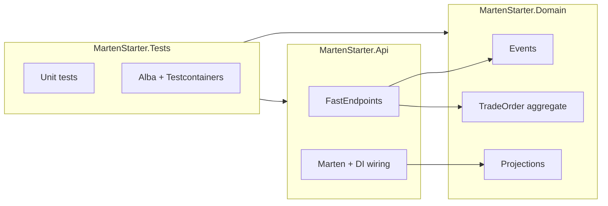
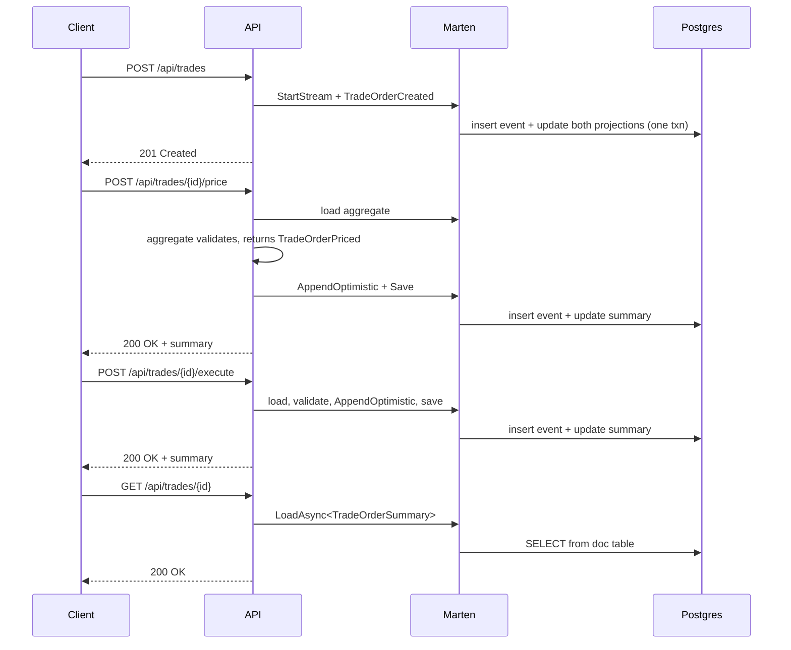

# Architecture

A short tour of why the code looks the way it does. Pair this with the [README](README.md) — that one shows what the repo *is*; this one explains the choices behind it.

## Three projects, three responsibilities



- **Domain** holds the events, the aggregate, and the projection classes. Events and the aggregate would still compile if you removed Marten from the solution — they're plain records and a plain class. The projection classes do touch Marten (they inherit `SingleStreamProjection<T,Guid>` and `MultiStreamProjection<T,string>`); that's the documented exception, because projections live closest to the events they project from.
- **Api** owns wiring and HTTP. Marten configuration, FastEndpoints registration, the error-mapping middleware, the endpoints themselves.
- **Tests** has both unit (no DB) and integration (real Postgres via Testcontainers).

## The aggregate split: decisions vs. state changes

`TradeOrder` has two kinds of methods, kept separate on purpose:

```csharp
// Decision: validates the transition, returns the event to append.
// Doesn't mutate the aggregate at all.
public TradeOrderPriced Price(decimal price, string currency, DateTimeOffset at)
{
    if (Status != TradeStatus.Created)
        throw new DomainException(...);
    return new TradeOrderPriced(Id, price, currency, at);
}

// State change: Marten invokes this when replaying the stream.
public void Apply(TradeOrderPriced priced)
{
    QuotedPrice = priced.Price;
    Status = TradeStatus.Priced;
    LastUpdated = priced.OccurredAt;
}
```

The same `Apply` runs for fresh events and replayed history. There's no "is this the first time?" branching, and no risk of two code paths drifting apart over time.

## Inline projections — same transaction, no eventual consistency

Both projections register with `ProjectionLifecycle.Inline`. That means a single `SaveChangesAsync` call atomically:

```
session.Events.StartStream(...) + Save
         |
         v
   one Postgres transaction
         |
   ┌─────┼──────────────────────┐
   v     v                      v
mt_events  mt_doc_tradeordersummary  mt_doc_dailytradevolume
```

Either all of it commits or none of it does. Reads can never see a stream that's ahead of its summary.

The trade-off versus async projections: every write pays the projection cost on the request thread. For a teaching repo with low write volume, that's the right call. For a high-throughput system you'd switch hot projections to `Async` and accept eventual consistency on the read model.

## Optimistic concurrency

Each lifecycle endpoint follows the same shape:

1. Load the aggregate via `AggregateStreamAsync<TradeOrder>(id)` — Marten remembers the current stream version.
2. Call a business method on the aggregate, which may throw `DomainException`.
3. Call `session.Events.AppendOptimistic(id, event)` — this pins the load-time version.
4. Call `SaveChangesAsync()` — fails with `ConcurrencyException` if another writer has moved the stream forward in between.

Two layers stack:

| Layer | Catches | Maps to |
|---|---|---|
| Aggregate guard | "this transition is illegal in current state" | 422 Unprocessable Entity |
| Marten optimistic check | "another writer beat us to the punch" | 409 Conflict |

The aggregate is the soft outer layer. The DB version check is the hard inner layer. Whichever fires first wins, and failed attempts leave no orphan events.

We didn't go further with HTTP-level `If-Match` / ETag headers. Marten's check already works race-free across concurrent HTTP requests because the version comparison happens at the database. Client-controlled versioning would be useful in scenarios where the client caches state for a long time before writing back; for an in-session "load → modify → save" flow, the database check is enough.

## Read model split: aggregate vs. summary

`TradeOrder` (write side) and `TradeOrderSummary` (read side) look almost identical today. That's a coincidence, not a rule. As the domain grows, the write aggregate stays focused on invariants; the read model picks up display fields, denormalised lookups (counterparty's display name, not just an id), derived flags. Keeping them separate from day one means you don't have to retrofit later.

`DailyTradeVolume` shows the other shape: many streams roll into one doc keyed by `(date, instrument)`. A different lifecycle (`MultiStreamProjection<T, string>`) and a different read model — but the same inline-commit story.

## Trade lifecycle (sequence)



## What's not here on purpose

- **Authentication / authorization.** Adds noise without teaching anything Marten-specific.
- **Async messaging (Rebus, RabbitMQ, etc.).** Different repo's job. This one is purely HTTP + DB.
- **Multi-tenancy.** Marten supports it; layering it in here would obscure the basics.
- **Sagas / process managers.** Worker-style flows belong in their own example.
- **Aspire / SignalR / Blazor.** Out of scope.

If you want any of those, fork the repo and add them — the foundation should hold.
