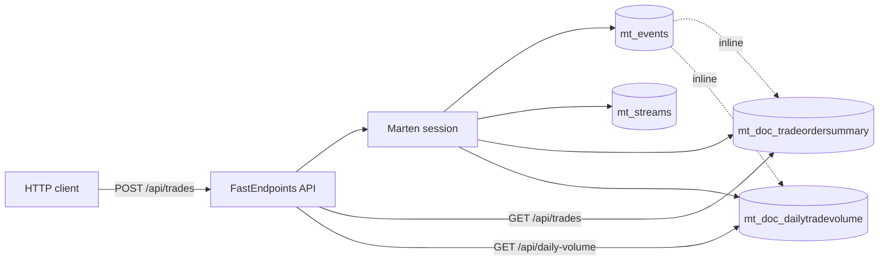
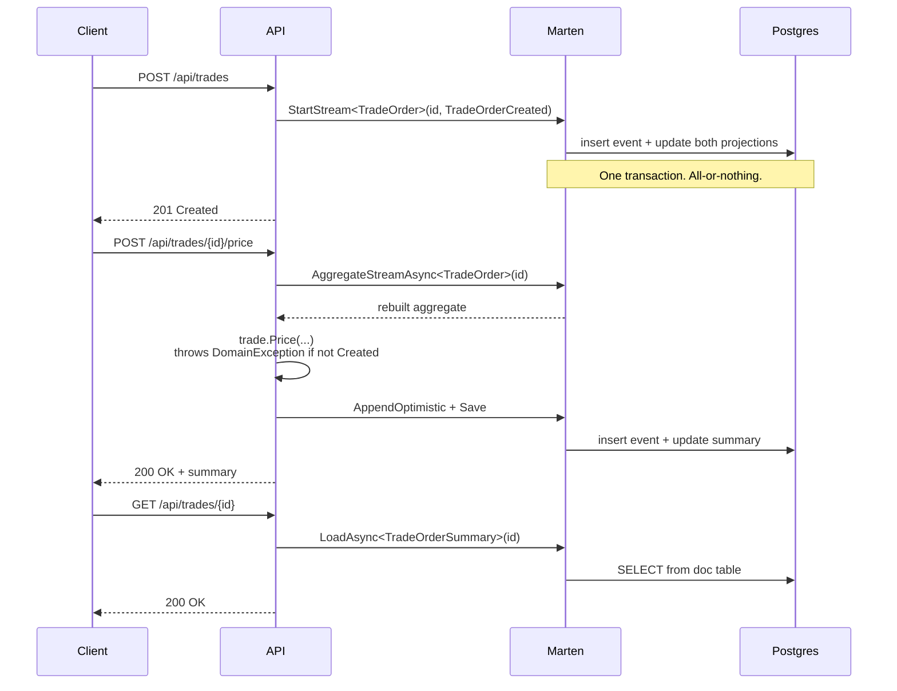

# dotnet-marten-starter

[](https://github.com/prithwirajdas007/dotnet-marten-starter/actions/workflows/ci.yml)

A minimal, opinionated reference for event sourcing with [Marten](https://martendb.io) and PostgreSQL on .NET 10. The whole thing is a small fintech-flavoured trade-lifecycle domain — enough to show every key Marten pattern, small enough to read in one sitting.

## Architecture



Events are the source of truth. Two inline projections keep read models in lockstep with the event stream — both updates land in the same Postgres transaction as the event append, so reads can never see an event that hasn't been projected yet.

## Quick start

You'll need .NET 10 SDK and Docker.

```sh
git clone https://github.com/prithwirajdas007/dotnet-marten-starter.git
cd dotnet-marten-starter
docker compose up -d                      # Postgres 16 on host port 5433
dotnet run --project src/MartenStarter.Api --urls=http://localhost:5050
```

Then poke at the API:

```sh
# Drop 5 sample trades across every lifecycle state
curl -X POST http://localhost:5050/api/seed

# List them
curl http://localhost:5050/api/trades

# Or create your own
curl -X POST http://localhost:5050/api/trades \
  -H "Content-Type: application/json" \
  -d '{"instrument":"USDCAD","quantity":1000000,"side":"Buy"}'
```

[`MartenStarter.Api.http`](src/MartenStarter.Api/MartenStarter.Api.http) has the full set of click-to-run scenarios for VS / Rider.

## What this demonstrates

| # | Pattern | Where |
|---|---|---|
| 1 | Aggregate with `Apply` methods | [TradeOrder.cs](src/MartenStarter.Domain/Aggregates/TradeOrder.cs) |
| 2 | Decision-vs-state-change split — business methods return events; `Apply` mutates | Same file |
| 3 | Event stream creation — `Events.StartStream<T>` | [CreateTradeEndpoint.cs](src/MartenStarter.Api/Endpoints/CreateTradeEndpoint.cs) |
| 4 | Live aggregation — rebuild from events | [PriceTradeEndpoint.cs](src/MartenStarter.Api/Endpoints/PriceTradeEndpoint.cs) and the rest of the lifecycle endpoints |
| 5 | Single-stream inline projection | [TradeOrderSummaryProjection.cs](src/MartenStarter.Domain/Projections/TradeOrderSummaryProjection.cs) |
| 6 | Cross-stream multi-projection (many streams → one doc) | [DailyTradeVolumeProjection.cs](src/MartenStarter.Domain/Projections/DailyTradeVolumeProjection.cs) |
| 7 | Optimistic concurrency — `AppendOptimistic` + `ConcurrencyException` → 409 | [PriceTradeEndpoint.cs](src/MartenStarter.Api/Endpoints/PriceTradeEndpoint.cs), [Program.cs](src/MartenStarter.Api/Program.cs) |
| 8 | LINQ over read models | [GetAllTradesEndpoint.cs](src/MartenStarter.Api/Endpoints/GetAllTradesEndpoint.cs) |
| 9 | Integration tests — Alba + Testcontainers | [IntegrationTestFixture.cs](tests/MartenStarter.Tests/Integration/IntegrationTestFixture.cs) |

For a deeper tour, see [ARCHITECTURE.md](ARCHITECTURE.md).

## Event flow



## API

| Method | Path | Purpose |
|---|---|---|
| POST | `/api/trades` | Create a trade |
| GET | `/api/trades` | List trades. Optional `?status=`, `?instrument=` |
| GET | `/api/trades/{id}` | Fetch one (from `TradeOrderSummary` projection) |
| POST | `/api/trades/{id}/price` | Quote a price |
| POST | `/api/trades/{id}/execute` | Execute |
| POST | `/api/trades/{id}/cancel` | Cancel |
| POST | `/api/trades/{id}/amend` | Amend quantity |
| GET | `/api/daily-volume` | Per-(date, instrument) rollup |
| POST | `/api/seed` | Drop 5 sample trades across every lifecycle state (demo) |

Errors come back in a consistent shape:

```json
{ "error": "business_rule | invalid_argument | concurrency", "message": "..." }
```

| Code | When |
|---|---|
| 400 | Bad input — blank instrument, zero quantity, blank reason (`ArgumentException`) |
| 404 | Trade doesn't exist |
| 409 | Concurrency conflict — two writers raced on the same stream |
| 422 | Business rule violation — e.g. cancel an already-executed trade (`DomainException`) |

## Testing

```sh
dotnet test
```

45 tests — 34 unit, 11 integration. Integration tests use [Testcontainers](https://dotnet.testcontainers.org/) to spin up Postgres on demand, so `dotnet test` is self-contained as long as Docker is running. Total run time around 10 seconds including container boot.

| Tier | What it covers | Speed |
|---|---|---|
| Unit | Aggregate transitions, projection Apply logic | < 100 ms |
| Integration | Full HTTP → DB → projection flow via Alba | ~ 8 s incl. container boot |

## Further reading

- [Marten documentation](https://martendb.io/) — start with the [Event Store guide](https://martendb.io/events/)
- [JasperFx blog](https://jeremydmiller.com/) — Jeremy Miller's posts on Marten internals and patterns
- [`ARCHITECTURE.md`](ARCHITECTURE.md) — deeper design tour for this repo

## About

Built by [Prithwiraj Das](https://prithwirajdas.ca) as a companion to a Medium walkthrough on Marten event sourcing. Issues and PRs welcome.
